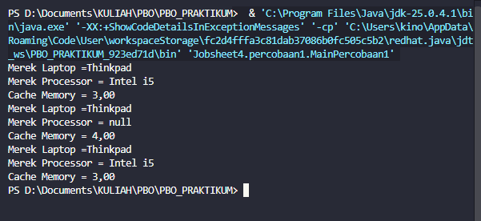
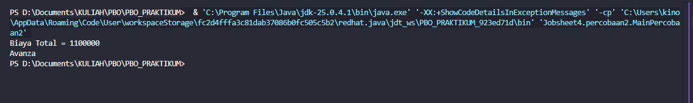
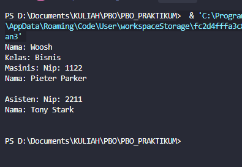
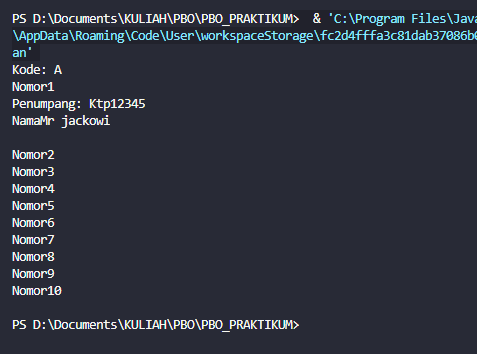
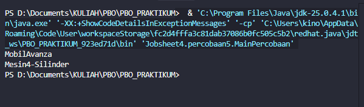
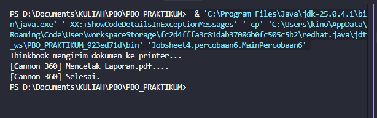
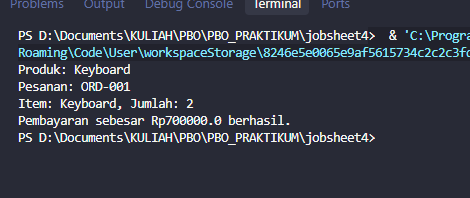

# Laporan Praktikum PBO – Pertemuan 3

## Identitas

| Keterangan | Data            |
| ---------- | --------------- |
| **Nama**   | Muhammad Farhan |
| **NIM**    | 264107027002    |
| **No**     | 14              |
| **Kelas**  | TI 2G           |

---

## Percobaan

### Percobaan 1: Aggregation Satu-ke-Satu (Laptop dan Processor)


#### Pertanyaan Percobaan 1

1. Di dalam class Processor dan class Laptop, terdapat method setter dan getter untuk masingmasing atributnya. Apakah gunanya method setter dan getter tersebut?

- Setter digunakan untuk memberikan atau mengubah nilai atribut dari luar class, sedangkan getter digunakan untuk mengambil atau membaca nilai atribut dari luar class. Setter dan getter juga membantu menerapkan enkapsulasi karena atribut dibuat private dan akses terhadap atribut dilakukan melalui method.

2. Di dalam class Processor dan class Laptop, masing-masing terdapat konstruktor default dan
   konstruktor berparameter. Bagaimanakah beda penggunaan dari kedua jenis konstruktor
   tersebut?

- Constructor default digunakan untuk membuat objek tanpa memberikan nilai atribut secara langsung sehingga atribut dapat diisi kemudian menggunakan setter. Constructor berparameter digunakan untuk membuat objek sekaligus memberikan nilai awal melalui parameter. Contohnya new Processor() menggunakan constructor default, sedangkan new Processor("Intel i5", 3) menggunakan constructor berparameter.

3. Perhatikan class Laptop, di antara 2 atribut yang dimiliki (merk dan proc), atribut manakah yang
   bertipe object? Baris kode manakah yang menunjukkan bahwa class Laptop memiliki relasi dengan
   class Processor?

- Atribut yang bertipe object adalah proc, karena tipenya adalah Processor, sedangkan merk bertipe String.

4. Perhatikan pada class Laptop, apakah guna dari sintaks proc.info()?

- proc.info() digunakan untuk memanggil method info() milik objek Processor yang dimiliki oleh Laptop. Dengan demikian, Laptop tidak perlu mencetak informasi Processor secara langsung, tetapi mendelegasikan tugas tersebut kepada objek Processor.

5. Pada Langkah 8, objek p dibuat lebih dulu baru diberikan ke constructor Laptop. Pada Langkah 10,
   objek Processor dibuat langsung di dalam argumen constructor Laptop (tanpa variabel p). Apakah
   keduanya menghasilkan output yang berbeda? Mengapa?

- Tidak. Keduanya menghasilkan output yang sama karena objek Processor yang diberikan kepada Laptop memiliki nilai yang sama. Perbedaannya hanya pada cara pembuatan objek. Pada Langkah 8 objek dibuat terlebih dahulu dalam variabel p, sedangkan pada Langkah 10 objek dibuat langsung sebagai argument constructor.

6. Secara kode, apakah relasi Laptop-Processor pada percobaan ini termasuk Aggregation atau
   Composition? Tunjukkan baris kode yang menjadi bukti jawabanmu.

- Relasi Laptop–Processor termasuk Aggregation. Buktinya adalah objek Processor dibuat di luar class Laptop, kemudian diberikan ke Laptop melalui constructor atau setter.

7. Andaikan constructor Laptop diubah menjadi seperti berikut, sehingga Processor dibuat sendiri di
   dalam Laptop, bukan diterima sebagai parameter:
   public Laptop (String merk) {
   this.merk = merk;
   this.proc = new Processor ("Generic", 1);
   }
   Apakah relasi Laptop-Processor pada versi ini masih Aggregation? Jelaskan alasannya (jawaban ini
   akan kita buktikan sendiri lewat kode pada Percobaan 5)

- Tidak. Relasinya berubah menjadi Composition, karena objek Processor dibuat langsung oleh class Laptop.

### Percobaan 2: Aggregation dengan Relasi Ganda (Rental Mobil)


#### Pertanyaan Percobaan 2

1. Perhatikan class Pelanggan. Pada baris program manakah yang menunjukkan bahwa class Pelanggan
   memiliki relasi dengan class Mobil dan class Sopir?
   10

- Karena mobil bertipe Mobil dan sopir bertipe Sopir, maka Pelanggan memiliki relasi dengan kedua class tersebut.

2. Perhatikan method hitungBiayaSopir pada class Sopir, serta method hitungBiayaMobil pada
   class Mobil. Mengapa method tersebut harus memiliki argument hari, padahal hari sendiri adalah
   atribut milik Pelanggan, bukan milik Mobil atau Sopir?

- Karena biaya Mobil dan Sopir dihitung berdasarkan jumlah hari penyewaan. Atribut hari memang berada di class Pelanggan, sehingga nilai tersebut dikirim sebagai parameter ke method hitungBiayaMobil() dan hitungBiayaSopir() agar kedua objek dapat melakukan perhitungan.

3. Perhatikan kode dari class Pelanggan. Untuk apakah perintah mobil.hitungBiayaMobil(hari) dan sopir.hitungBiayaSopir(hari)?

- Kedua perintah tersebut digunakan untuk meminta objek Mobil dan Sopir menghitung biaya masing-masing berdasarkan jumlah hari. Hasil dari kedua perhitungan kemudian dijumlahkan oleh method hitungBiayaTotal() milik Pelanggan.

4.  Perhatikan class MainPercobaan2. Untuk apakah sintaks p.setMobil(m) dan p.setSopir(s)?
    - Keduanya digunakan untuk memasukkan referensi objek Mobil dan Sopir ke dalam objek Pelanggan.

          ```
          p.setMobil(m);
          p.setSopir(s);
          ```

      Dengan begitu atribut mobil dan sopir di dalam objek p tidak lagi bernilai null.

5.  Untuk apakah proses p.hitungBiayaTotal()?

- Method tersebut digunakan untuk menghitung total biaya rental Mobil dan Sopir berdasarkan jumlah hari yang disewa.

6.  Pada Langkah 7, p.getMobil().getMerk() memanggil dua method sekaligus secara berantai.
    Jelaskan urutan eksekusinya: objek apa yang dikembalikan p.getMobil(), dan objek apa yang
    kemudian dipanggil .getMerk()-nya?

- Pertama, p.getMobil() dijalankan untuk mendapatkan objek Mobil yang disimpan di dalam objek Pelanggan. Setelah objek Mobil diperoleh, method .getMerk() dipanggil pada objek Mobil tersebut untuk mendapatkan nilai mereknya.

7.  Andaikan p.setMobil(m) tidak pernah dipanggil lalu p.hitungBiayaTotal() dijalankan, error
    apa yang akan muncul? Jelaskan mengapa error itu terjadi, dikaitkan dengan konsep referensi objek
    yang sudah kita pelajari sebelumnya.

- Program akan menghasilkan NullPointerException ketika p.hitungBiayaTotal() dijalankan. Hal tersebut terjadi karena atribut mobil pada objek Pelanggan masih bernilai null, tetapi program mencoba

### Percobaan 3: Aggregation dengan Dua Role ke Kelas yang Sama (Kereta Api)


#### Pertanyaan Percobaan 3

1. Di dalam method info() pada class KeretaApi, baris this.masinis.info() dan this.asisten.info() digunakan untuk apa?

- Keduanya digunakan untuk memanggil method info() dari objek Pegawai yang disimpan pada atribut masinis dan asisten. Dengan demikian informasi masing-masing pegawai dapat ditampilkan melalui class KeretaApi.

2. Apa hasil output dari MainPertanyaan sebelum diperbaiki (Langkah 8)? Mengapa hal tersebut dapat
   terjadi?

- Program mengalami NullPointerException ketika menjalankan:

   ```
   this.asisten.info()
   ```

   Hal tersebut terjadi karena KeretaApi dibuat menggunakan constructor tiga parameter yang hanya mengisi masinis, sedangkan asisten tidak pernah diberikan nilai sehingga masih null.

3. Kaitkan dengan materi referensi objek: apa isi variabel asisten di dalam objek KeretaApi yang
   dibuat lewat constructor 3-parameter, sebelum guard clause ditambahkan?

- Nilai asisten adalah null. Constructor tiga parameter hanya mengisi:

   ```
   this.nama = nama;
   this.kelas = kelas;
   this.masinis = masinis;
   ```

   Tidak ada proses pengisian this.asisten, sehingga nilainya tetap null.

4. Setelah guard clause ditambahkan (Langkah 9), apakah objek masinis juga perlu dicek dengan cara
   yang sama? Perhatikan kedua constructor KeretaApi, apakah mungkin masinis bernilai null?
   Jelaskan.
   
- Tidak harus berdasarkan desain constructor pada jobsheet, karena kedua constructor KeretaApi selalu menerima parameter Pegawai masinis dan langsung menyimpannya ke atribut masinis.

5. Kelas Pegawai dipakai lewat dua atribut berbeda (masinis dan asisten) pada KeretaApi. Apakah
   ini membuat KeretaApi punya dua objek Pegawai yang berbeda, atau satu objek Pegawai yang
   dipakai dua kali? Jelaskan berdasarkan kode pada Langkah 6.

- Pada contoh Langkah 6 terdapat dua objek Pegawai yang berbeda karena dibuat menggunakan dua new:

   ```
   Pegawai masinis = new Pegawai("1234", "Spongebob Squarepants");
   Pegawai asisten = new Pegawai("4567", "Patrick Star");
   ```

   Kemudian kedua objek tersebut diberikan ke atribut masinis dan asisten. Jadi dalam contoh tersebut terdapat dua objek Pegawai berbeda dengan dua role berbeda.

### Percobaan 4: Array of Object dan Multiplicity (Gerbong, Kursi, dan Penumpang)


#### Pertanyaan Percobaan 4


1. Pada main program dalam class MainPercobaan4, berapakah jumlah kursi dalam Gerbong A?
   
- Jumlah kursi adalah 10, karena objek dibuat dengan:

    ```
    Gerbong gerbong = new Gerbong("A", 10);
    ```

    Jobsheet juga menyebutkan output mencetak 10 kursi, dari nomor 1 sampai 10.

2. Perhatikan potongan kode if (this.penumpang != null) { ... } pada method info()
   dalam class Kursi. Apa maksud kode tersebut?
   
- Kode tersebut digunakan untuk mengecek apakah kursi sudah memiliki penumpang. Jika penumpang tidak null, maka informasi penumpang akan ditampilkan. Jika masih null, informasi penumpang tidak ditampilkan.

3. Mengapa pada method setPenumpang() dalam class Gerbong, nilai nomor dikurangi dengan angka
   1?
   17

- Karena nomor kursi yang digunakan manusia dimulai dari 1, sedangkan indeks array Java dimulai dari 0.

4. Instansiasi objek baru budi dengan tipe Penumpang, kemudian masukkan objek baru tersebut pada
   gerbong dengan gerbong.setPenumpang(budi, 1), menimpa Mr. Krab yang sudah duduk di
   sana. Apakah yang terjadi? Apakah Java memberi peringatan/error?

- Objek Budi akan menggantikan referensi Mr. Krab pada kursi tersebut. Java tidak memberikan error atau peringatan karena secara kode assignment tersebut valid.

5. Modifikasi program sehingga tidak diperkenankan menduduki kursi yang sudah ada penumpang lain
   (tambahkan pengecekan pada Gerbong.setPenumpang() sebelum baris arrayKursi[nomor - 1].setPenumpang(...) dijalankan).

- Tambahkan pengecekan sebelum melakukan setPenumpang():

    ```
    public void setPenumpang(Penumpang penumpang, int nomor) {
        if (this.arrayKursi[nomor - 1].getPenumpang() == null) {
            this.arrayKursi[nomor - 1].setPenumpang(penumpang);
        } else {
            System.out.println("Kursi sudah ditempati.");
        }
    }
    ```

    Dengan demikian, penumpang baru hanya dapat ditempatkan pada kursi yang masih kosong.

6. Bandingkan tiga bentuk relasi has-a yang sudah kita praktikkan: Laptop-Processor (Percobaan 1, 1-
   1), KeretaApi-Pegawai (Percobaan 3, dua relasi 1-1 bernama), dan Gerbong-Kursi (Percobaan 4, 1..\*).
   Untuk kasus seperti apa kita akan memilih array, dan untuk kasus seperti apa kita akan memilih
   atribut bernama satu-satu?

- Array digunakan ketika sebuah objek memiliki banyak objek lain dengan jumlah yang dapat berubah atau tidak tetap, seperti satu Gerbong yang memiliki banyak Kursi. Atribut satu-satu digunakan ketika jumlah relasi sedikit dan setiap objek memiliki role yang berbeda dan jelas, seperti masinis dan asisten pada KeretaApi. Jobsheet menjelaskan bahwa dua role tetap tidak perlu dibuat sebagai array, sedangkan jumlah objek yang dinamis lebih sesuai menggunakan array.

7. Terapkan kriteria kode (siapa yang memanggil new) pada dua relasi has-a di Percobaan ini: GerbongKursi dan Kursi-Penumpang. Manakah yang Aggregation dan manakah yang Composition? Tunjukkan
   baris kode yang menjadi bukti untuk masing-masing.

- Gerbong–Kursi = Composition.

### Percobaan 5: Composition (Mobil dan Mesin)



#### Pertanyaan Percobaan 5

1. Pada class Mobil, baris manakah yang menunjukkan bahwa Mesin adalah bagian yang “dimiliki
   secara eksklusif” oleh Mobil (bukan sekadar “dipinjam”)?

- Barisnya adalah:

    ```
    this.mesin = new Mesin();
    ```

    Baris tersebut berada di dalam constructor Mobil, sehingga Mobil sendiri yang membuat objek Mesin.

2. Apa yang terjadi secara desain jika ditambahkan method setMesin(Mesin mesin) pada class
   Mobil? Apakah relasi ini akan tetap menjadi Composition? Jelaskan.

- maka desain kepemilikan eksklusif menjadi lebih lemah karena objek dari luar dapat mengganti Mesin milik Mobil. Dalam konteks aturan jobsheet, pola tersebut tidak lagi menunjukkan Composition murni karena Mesin dapat diberikan dari luar.

3. Bandingkan dengan Percobaan 1 (Laptop-Processor): sebutkan satu perbedaan baris kode yang membuat salah satunya Aggregation dan yang lain Composition.

- Pada Laptop, objek Processor diterima dari luar melalui parameter constructor:

    ```
    public Laptop(String merk, Processor proc)
    ```
    sehingga termasuk Aggregation.

    Sedangkan Mobil membuat Mesin sendiri:

    ```
    this.mesin = new Mesin();
    ```
    sehingga termasuk Composition.

4. Jika objek mobil di MainPercobaan5 di-set null setelah tampilkanInfo() dipanggil, apa yang
   terjadi pada objek Mesin miliknya? Bandingkan dengan nasib objek Processor pada Percobaan 1
   seandainya objek Laptop-nya dihapus, apakah Processor tersebut masih bisa “diselamatkan” oleh
   kode lain? Kenapa Mesin tidak bisa?

- Jika tidak ada referensi lain yang menunjuk ke objek Mesin, maka Mesin tersebut tidak lagi dapat diakses dan nantinya dapat dibersihkan oleh Garbage Collector Java.

    Berbeda dengan Processor pada Aggregation, objek Processor dapat tetap digunakan apabila masih terdapat referensi lain yang menunjuk kepadanya.

5. Coba (secara terpisah, boleh di file/package percobaan sendiri) tambahkan constructor kedua pada
   Mobil yang menerima parameter Mesin, mirip pola Percobaan 1: public Mobil(String merek,
   Mesin mesin) { this.merek = merek; this.mesin = mesin; }. Kalau constructor ini yang
   dipakai, apakah Mobil-Mesin berubah menjadi Aggregation? Jelaskan alasannya.

- Ya, berdasarkan kriteria kode pada jobsheet relasinya berubah menjadi Aggregation.

### Percobaan 6: Dependency / Uses-A (Laptop Mencetak Dokumen ke Printer)



#### Pertanyaan Percobaan 6

1. Apakah class Laptop pada percobaan ini memiliki atribut bertipe Printer? Bandingkan dengan
   Percobaan 1, di mana Processor disimpan sebagai atribut Laptop.

- Tidak. Class Laptop hanya memiliki:

    ```
    private String merk;
    ```

    Printer hanya muncul sebagai parameter pada method:

    ```
    public void cetakDokumen(Printer printer, String namaFile)
    ```

    Hal ini berbeda dengan Percobaan 1, di mana Processor disimpan sebagai atribut Laptop.

2. Setelah method cetakDokumen() selesai dijalankan, apakah Laptop masih menyimpan referensi ke
   objek printer yang tadi dipakai? Jelaskan berdasarkan baris kode class Laptop.

- Tidak. Printer hanya digunakan sebagai parameter method cetakDokumen(), sehingga Laptop tidak menyimpan referensi tersebut sebagai atribut. Setelah method selesai, Laptop tidak memiliki atribut yang menyimpan objek Printer.

3. Mengapa relasi Laptop-Printer pada percobaan ini disebut Dependency (uses-a), bukan Aggregation,
   meskipun sama-sama melibatkan dua objek yang saling berinteraksi?

- Karena Laptop hanya menggunakan objek Printer sementara melalui parameter method dan tidak menyimpannya sebagai atribut. Berbeda dengan Aggregation dan Composition yang menyimpan objek terkait sebagai atribut.

4. Coba ubah kode Laptop supaya Printer disimpan sebagai atribut (mis. private Printer
   printerDefault, diisi lewat constructor atau setter, lalu dipakai kembali di cetakDokumen()
   tanpa parameter Printer). Apakah relasi ini sekarang berubah dari Dependency menjadi
   Aggregation? Jelaskan.
   
- Ya, berdasarkan pola yang digunakan dalam jobsheet, jika Printer disimpan sebagai atribut Laptop dan objeknya diberikan dari luar melalui constructor atau setter, maka relasinya menjadi Aggregation.

5. Lengkapi tabel berikut dengan kata-katamu sendiri (boleh dijawab di laporan): untuk masing-masing
   dari Aggregation, Composition, dan Dependency, sebutkan (a) apakah objek part disimpan sebagai
   atribut atau tidak, dan (b) siapa yang memanggil new untuk membuat objek part tersebut.

   | Relasi | Disimpan sebagai atribut? | Siapa yang memanggil `new`? |
   |---|---|---|
   | Aggregation | Ya | Class lain / kode di luar whole |
   | Composition | Ya | Class whole sendiri |
   | Dependency | Tidak | Biasanya kode yang menggunakan objek tersebut dari luar |

## D. Tugas dan Deliverable

### Tugas mandiri:

#### UseCase

1. Rancang satu studi kasus sendiri (bebas topiknya, misalnya perpustakaan, klinik, toko online, dsb.),
   gambarkan diagram kelasnya, lalu implementasikan ke dalam program. Studi kasus wajib melibatkan
   minimal 4 class (class yang berisi main tidak dihitung) dan wajib mencakup ketiganya: minimal satu
   relasi Aggregation, satu Composition, dan satu Dependency. Tandai pada laporanmu, bagian mana
   dari kode yang merupakan masing-masing jenis relasi tersebut, dan sertakan alasannya.



### Penjelasan Relasi

| Relasi      | Class                    | Bukti Kode                                        | Alasan                                                              |
| ----------- | ------------------------ | ------------------------------------------------- | ------------------------------------------------------------------- |
| Aggregation | Toko → Produk            | `private Produk produk;`                          | Produk dibuat di luar Toko dan diberikan melalui constructor        |
| Composition | Pesanan → ItemPesanan    | `this.item = new ItemPesanan(...)`                | Pesanan membuat sendiri objek ItemPesanan                           |
| Dependency  | Pesanan → PaymentService | `prosesPembayaran(PaymentService paymentService)` | PaymentService hanya digunakan sebagai parameter dan tidak disimpan |

2. Jawab singkat (3-5 kalimat): dalam merancang sistem barumu sendiri, bagaimana kita memutuskan
   sebuah relasi antar class seharusnya Aggregation, Composition, atau Dependency? Sebutkan
   pertanyaan kunci yang kita ajukan ke diri sendiri saat memutuskan.

- Dalam menentukan jenis relasi antar class, hal pertama yang perlu diperhatikan adalah apakah objek dari class lain akan disimpan sebagai atribut atau hanya digunakan sementara. Jika objek dibuat dan dimiliki langsung oleh class utama, maka relasinya dapat menggunakan Composition. Jika objek dibuat dari luar kemudian diberikan dan disimpan sebagai atribut, maka relasinya menggunakan Aggregation. Jika objek hanya digunakan sementara melalui parameter method dan tidak disimpan sebagai atribut, maka relasinya menggunakan Dependency. Pertanyaan kunci yang dapat digunakan adalah siapa yang membuat objek, apakah objek tersebut disimpan, dan apakah lifecycle objek tersebut bergantung pada class yang menggunakannya.
