# Laporan Praktikum PBO – Pertemuan 6

## Identitas

| Keterangan | Data            |
| ---------- | --------------- |
| **Nama**   | Muhammad Farhan |
| **NIM**    | 264107027002    |
| **No**     | 14              |
| **Kelas**  | TI 2G           |

---

## Percobaan 

### Percobaan 1: Single Inheritance dengan extends (ClassA dan ClassB)
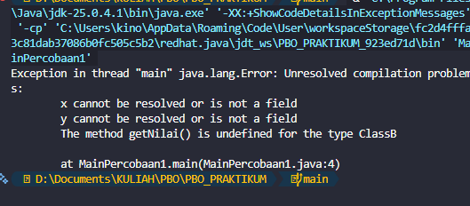
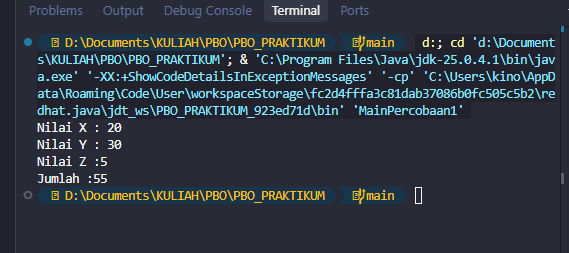

#### Pertanyaan Percobaan 1
1. Mengapa kompilasi pada Langkah 5 gagal? Tuliskan pesan error pertama beserta file dan
baris tempat error muncul.

- Karena ClassB belum extends ClassA, sehingga x dan y tidak dikenali. Error pertama berupa cannot find symbol pada ClassB.java.

2. Baris kode mana yang diubah pada Langkah 6, dan apa artinya? Sebutkan class yang
berperan sebagai superclass dan subclass.

- Mengubah:

    ```
    public class ClassB
    ```
    menjadi:

    ```
    public class ClassB extends ClassA
    ```

3. Setelah diperbaiki, sebutkan atribut dan method yang dapat dipakai oleh objek hitung.
Kelompokkan mana yang dideklarasikan di ClassA dan mana yang dideklarasikan di ClassB.

-  Dari ClassA: x, y, getNilai().
    
    Dari ClassB: z, getNilaiZ(), getJumlah().


4. Pada MainPercobaan1, hitung.x = 20 ditulis pada objek ClassB, padahal atribut x tidak
dideklarasikan di ClassB. Mengapa hal ini diperbolehkan?

- Karena x diwariskan dari ClassA ke ClassB dan memiliki access modifier public.


5. Atribut x dan y pada ClassA dibuat public, sehingga dapat diubah langsung dari
MainPercobaan1. Apa risiko dari desain seperti ini? (jawaban ini akan kita telusuri pada
Percobaan 2)

- Data dapat diubah langsung dari class lain sehingga encapsulation menjadi lemah.

6. Coba tambahkan class ClassD lalu ubah deklarasi menjadi public class ClassB extends
ClassA, ClassD. Apa yang terjadi? Apa yang dapat Anda simpulkan tentang jumlah
superclass langsung pada Java?

- Terjadi error karena Java hanya mengizinkan satu superclass langsung (single inheritance).

### Percobaan 2: Hak Akses pada Pewarisan (private dan protected)
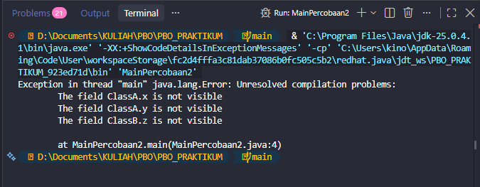
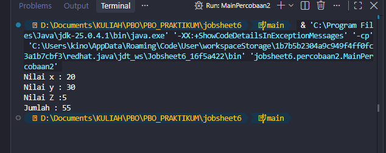
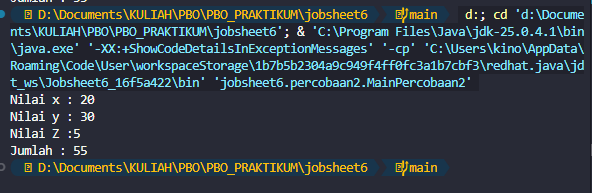

#### Pertanyaan Percobaan 2
1. Di file dan baris mana error pada Langkah 5 muncul, dan apa pesannya? Mengapa error
tidak muncul di MainPercobaan2?

- Di ClassB.java baris 15, dengan pesan x has private access in ClassA dan y has private access in ClassA.

2. Jelaskan penyebab error tersebut dengan merujuk pada tabel kontrol pengaksesan
(Langkah 1).

- Karena x dan y bersifat private, sehingga tidak dapat diakses langsung oleh subclass.

3. Pada kode awal, MainPercobaan2 memanggil hitung.setX(20) dan tidak error, padahal x
bersifat private. Mengapa pemanggilan ini diperbolehkan, dan di mana nilai x tersimpan?

- Karena setX() bersifat public. Method tersebut yang mengubah atribut x yang tetap tersimpan di ClassA.

4. Bandingkan Perbaikan A (protected) dan Perbaikan B (private + getter) dari sisi
encapsulation. Mana yang Anda pilih untuk program sungguhan? Jelaskan alasannya.

- private + getter lebih baik karena encapsulation lebih terjaga dan akses data dapat dikontrol.

5. Andaikan ClassA dan ClassB berada di package yang berbeda. Berdasarkan tabel, apakah
ClassB tetap dapat mengakses atribut protected milik ClassA? Bagaimana jika atributnya
default (tanpa modifier)?

- protected masih dapat diakses oleh subclass, sedangkan default tidak dapat diakses oleh subclass yang berbeda package.

### Percobaan 3: Kata Kunci this dan super (Bangun dan Tabung)


#### Pertanyaan Percobaan 3
1. Jelaskan fungsi super pada super.phi = phi; dan super.r = r; di method setSuperPhi()
dan setSuperR() milik Tabung.

- Untuk mengakses atribut phi dan r milik superclass Bangun.

2. Jelaskan fungsi super dan this pada ekspresi super.phi * super.r * super.r * this.t di
method volume().

- super.phi dan super.r mengakses atribut Bangun, sedangkan this.t mengakses atribut Tabung.

3. Mengapa Tabung tidak mendeklarasikan atribut phi dan r, tetapi tetap dapat
mengaksesnya? Apa yang terjadi bila pada Bangun keduanya diubah menjadi private?

- Karena keduanya protected. Jika diubah menjadi private, Tabung tidak dapat mengaksesnya langsung.

4. Pada Eksperimen 1, apakah output berubah ketika super.phi diganti this.phi? Jelaskan
mengapa.

- Tidak, karena Tabung tidak memiliki phi sendiri sehingga this.phi tetap merujuk phi dari Bangun.

5. Pada Eksperimen 2, mengapa r, this.r, dan super.r menghasilkan nilai yang berbeda?
Pada kondisi apa awalan super. menjadi wajib dipakai?

- Karena Tabung memiliki r sendiri (5), sedangkan Bangun memiliki r (10). super.r digunakan untuk mengakses milik superclass.     Jobsheet 06 - Inheritance revis…

### Percobaan 4: Konstruktor dan Multilevel Inheritance (ClassA, ClassB,ClassC)

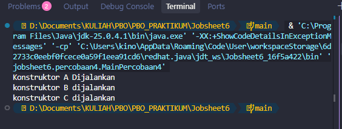


#### Pertanyaan Percobaan 4
1. Sebutkan class yang berperan sebagai superclass dan subclass pada percobaan ini beserta
alasannya. Mengapa ClassB disebut berperan ganda?

- ClassA → superclass ClassB.
    
    ClassB → subclass ClassA dan superclass ClassC.
    
    ClassC → subclass ClassB.

2. Program hanya membuat satu objek (new ClassC()), tetapi tiga baris tercetak. Jelaskan
mengapa konstruktor ClassA dan ClassB ikut dijalankan.

- Karena saat new ClassC() dibuat, constructor superclass dijalankan terlebih dahulu: ClassA → ClassB → ClassC.

3. Pada Modifikasi 1, mengapa output tidak berbeda dari sebelumnya meskipun super();
ditambahkan secara eksplisit?

- Karena tanpa ditulis pun Java otomatis memanggil super() sebagai statement pertama.

4. Pada Modifikasi 2 terjadi error. Aturan apa yang dilanggar, dan mengapa Java menetapkan
aturan tersebut?

- Karena super() wajib menjadi statement pertama dalam constructor.

5. Tuliskan urutan proses (bernomor) yang terjadi ketika new ClassC() dieksekusi, dimulai
dari pemanggilan konstruktor ClassC hingga seluruh output tercetak.

- ClassC dipanggil → super() → constructor ClassB → super() → constructor ClassA → kembali ke ClassB → kembali ke ClassC. Output: A → B → C.     Jobsheet 06 - Inheritance revis…

### Percobaan 5: Konstruktor Berparameter dan Overriding (Komputer,Desktop, Laptop)

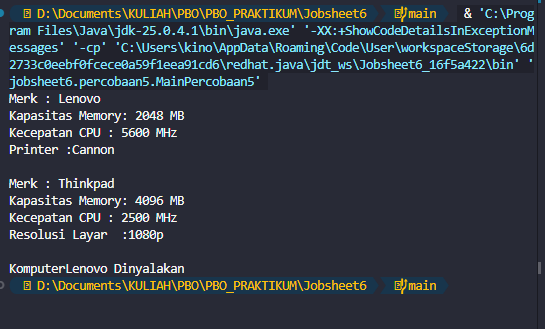
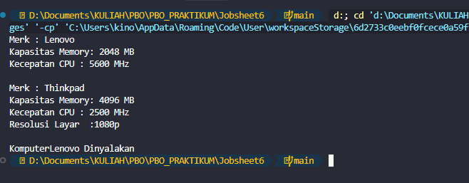

#### Pertanyaan Percobaan 5
1. Jelaskan fungsi super(merk, memory, cpu) pada konstruktor Desktop. Atribut apa saja yang
diisi oleh baris tersebut, dan atribut apa yang diisi oleh baris berikutnya?

- Memanggil constructor Komputer untuk mengisi merk, kapasitasMemory, dan kecepatanCPU. printer diisi oleh Desktop.

2. Pada Eksperimen 1, mengapa error muncul di sini, padahal pada Percobaan 4 super() juga
tidak ditulis tetapi program tetap berjalan?

- Karena Komputer hanya memiliki constructor berparameter. Tanpa super(...), Java mencoba memanggil super() yang tidak tersedia.

3. Method showInfo() ditulis di Komputer sekaligus di Desktop. Apa istilah untuk kondisi ini?
Apa yang tercetak bila baris super.showInfo(); pada Desktop dihapus?

- Overriding. Jika super.showInfo() dihapus, informasi dari Komputer tidak ditampilkan.

4. Pada Eksperimen 2, jelaskan perbedaan hasil kompilasi dengan dan tanpa @Override. Apa
manfaat menuliskan @Override?

- Dengan @Override, kesalahan nama/signature method akan terdeteksi compiler. Tanpa @Override, method yang salah dapat dianggap sebagai method baru.

5. Tantangan. Buat class Workstation sebagai turunan Desktop dengan atribut gpu (String).
Class ini harus menimpa showInfo() sehingga menampilkan seluruh informasi Desktop
ditambah baris GPU. Ketika new Workstation(...) dibuat, konstruktor class apa saja yang
terpanggil, dan dalam urutan apa?

- Workstation mewarisi Desktop, menambahkan gpu, dan override showInfo(). Urutan constructor: Komputer → Desktop → Workstation.     Jobsheet 06 - Inheritance revis…


## Tugas D. Tugas dan Deliverable

### Tugas 1: Pegawai, Dosen, dan DaftarGaji
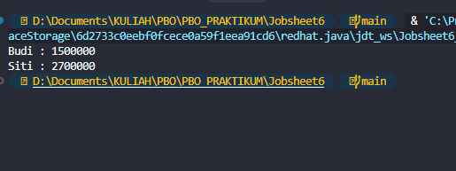

### Tugas 2: Televisi dan TelevisiModern
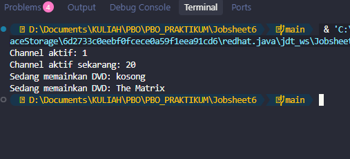

### Tugas 3 (opsional, pengayaan): Karakter Game
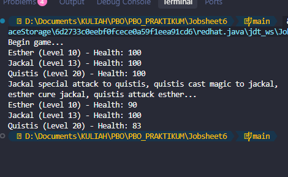
