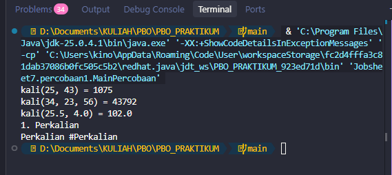
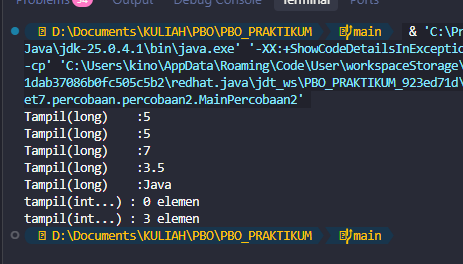
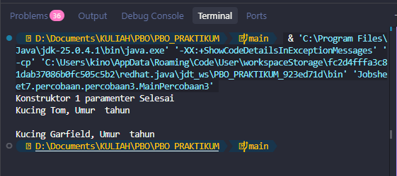
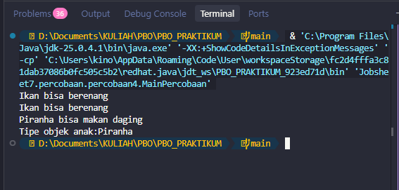
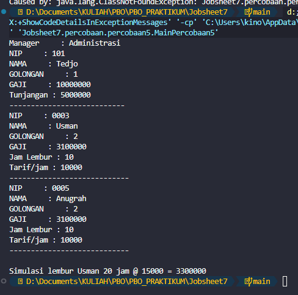
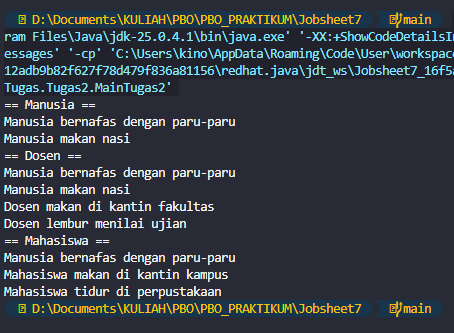
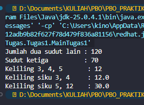

# Laporan Praktikum PBO – Pertemuan 7
## Overloading dan Overriding

## Identitas

| Keterangan | Data |
| --- | --- |
| **Nama** | Muhammad Farhan |
| **NIM** | 264107023002 |
| **No** | 14 |
| **Kelas** | TI 2G |

---

## Percobaan

### Percobaan 1: Overloading Method (Perkalian)

#### Pertanyaan Percobaan 1

1. Method yang di-overload adalah `kali(int,int)`, `kali(int,int,int)`, `kali(double,double)`, `tampilkan(int,String)`, dan `tampilkan(String,int)`. Pembeda berupa jumlah, tipe, atau urutan parameter.
2. `kali(double,double)` dipanggil karena argumennya bertipe `double`.
3. Urutan tipe parameter menjadi pembeda signature. Nama parameter dan tipe kembalian bukan pembeda.
4. `kali(5, 2.5)` menghasilkan `12.5` karena nilai `int` dapat diperlebar menjadi `double`.

**Tabel eksperimen**

| Eksperimen | Hasil |
| --- | --- |
| Menambah `long kali(int,int)` | Error: method dengan parameter `int,int` sudah didefinisikan. |
| Menambah `int kali(int x,int y)` | Error: nama parameter tidak membedakan method. |
| Memanggil `kali(5,2.5)`, `kali(2,3)`, `kali(2.0,3)` | Output: `12.5`, `6`, `6.0`. |

### Percobaan 2: Pemilihan Overload oleh Compiler

**Tabel pengamatan**

| Pemanggilan | Method terpilih |
| --- | --- |
| `tampil(5)` | `tampil(long)` |
| `tampil(5L)` | `tampil(long)` |
| `tampil(Integer.valueOf(7))` | `tampil(Integer)` |
| `tampil(3.5)` | `tampil(Object)` |
| `tampil("Java")` | `tampil(Object)` |
| `tampil()` | `tampil(int...)` |
| `tampil(1,2,3)` | `tampil(int...)` |

#### Pertanyaan Percobaan 2

1. `tampil(5)` memilih `tampil(long)` karena widening diprioritaskan sebelum boxing.
2. Saat overload dihapus bertahap, hasilnya berpindah dari `long`, ke `Integer`, ke `Object`, lalu `int...`.
3. `tampilLong(5)` error karena Java tidak mengizinkan widening lalu boxing dari `int` menjadi `Long`. `tampil(Object)` dapat menerima nilai melalui boxing menjadi `Integer`, lalu widening reference.
4. `tampil((short) 3)` memilih `tampil(long)` dan mencetak `3`. `tampil('A')` memilih `tampil(long)` dan mencetak `65`.

**Eksperimen widening lalu boxing:** `tampilLong(5)` menghasilkan error `incompatible types: int cannot be converted to Long`.

### Percobaan 3: Overloading Konstruktor (Kucing)

#### Pertanyaan Percobaan 3

1. Konstruktor dua parameter tercetak lebih dulu karena konstruktor satu parameter memanggil `this(nama, 1)`.
2. `this(nama, 1)` menghindari pengulangan kode inisialisasi.
3. Jika ditambah konstruktor `Kucing()` yang memanggil `this("Tanpa Nama")`, urutannya adalah konstruktor dua parameter, satu parameter, lalu nol parameter. Output tambahannya: `Konstruktor 0 parameter selesai`, lalu info kucing.

**Eksperimen konstruktor tanpa parameter:** `new Kucing()` error jika konstruktor nol parameter belum dibuat, dengan pesan `no suitable constructor found for Kucing(no arguments)`.

### Percobaan 4: Overriding (Ikan dan Piranha)

**Tabel eksperimen**

| Perubahan | Hasil |
| --- | --- |
| Menghapus `public` dari `swim()` di Piranha | Error: akses method lebih sempit dari superclass. |
| Menambahkan `final` pada `swim()` di Ikan | Error: method final tidak dapat di-override. |
| Mengubah menjadi `swim(int jarak)` dengan `@Override` | Error: method tidak meng-override method superclass. |
| Menambahkan `throws Exception` | Error: checked exception baru tidak diizinkan. |

#### Pertanyaan Percobaan 4

1. `a.swim()` mencetak `Ikan bisa berenang`. `c.swim()` mencetak pesan Ikan dan Piranha karena memanggil `super.swim()`. Jika `super.swim()` dihapus, pesan Ikan tidak tercetak.
2. Covariant return memungkinkan `Piranha.beranak()` mengembalikan `Piranha`. `Piranha anak = a.beranak()` tidak valid tanpa casting karena `a` bertipe `Ikan`.
3. Aturan yang dilanggar: akses tidak boleh dipersempit, method `final` tidak boleh di-override, signature harus sama, dan checked exception tidak boleh diperluas.
4. Tanpa `@Override`, `swim(int)` menjadi overload baru, bukan override.
5. Jika `Ikan.swim()` dibuat `private`, method itu tidak dapat di-override; penggunaan `@Override` pada Piranha menyebabkan error.

### Percobaan 5: Karyawan, Staff, dan Manager

#### Pertanyaan Percobaan 5

1. Overloading: `Staff.getGaji(int,double)`. Overriding: `Staff.getGaji()`, `Manager.getGaji()`, serta method `lihatInfo()` pada Staff dan Manager.
2. `super.getGaji()` mengambil gaji pokok. Jika overload memanggil `getGaji()` kembali, terjadi rekursi yang berujung `StackOverflowError`.
3. Jika `Staff.getGaji()` hanya mengembalikan uang lembur, gaji pokok Staff tidak dihitung. Gaji Manager tidak berubah.
4. Manager dengan Staff adalah **has-a** melalui atribut `Staff[] bawahan`. Manager dengan Karyawan adalah **is-a** karena `Manager extends Karyawan`.

**Hasil gaji**

| Karyawan | Gaji |
| --- | ---: |
| Tedjo | 10.000.000 |
| Usman | 3.100.000 |
| Anugrah | 3.550.000 |
| Simulasi lembur Usman | 3.300.000 |

---

## Tugas Mandiri

### Tugas 1: Overloading pada Segitiga

1. Kedua method `keliling()` sah sebagai overloading karena jumlah parameternya berbeda, bukan karena tipe kembaliannya.
2. `keliling(3, 4.0)` menyebabkan compilation error karena tidak ada method dengan parameter `(int, double)`.

### Tugas 2: Overriding pada Manusia, Dosen, dan Mahasiswa

1. `Mahasiswa` mewarisi `bernafas()` dari `Manusia`, tetapi meng-override `makan()`.
2. `Dosen.makan()` memanggil `super.makan()` sehingga mencetak makan nasi dan makan di kantin fakultas. `Mahasiswa.makan()` hanya mencetak makan di kantin kampus.

### Tugas 3: Perbandingan Overloading dan Overriding

| Aspek | Overloading | Overriding |
| --- | --- | --- |
| Lokasi | Satu class atau hubungan pewarisan | Subclass dan superclass |
| Parameter | Harus berbeda | Harus sama |
| Tipe kembalian | Bukan pembeda utama | Sama atau covariant |
| Access modifier | Mengikuti aturan akses | Tidak boleh lebih sempit dari superclass |
| `@Override` | Tidak diperlukan | Memastikan method benar-benar di-override |

- **Overloading** dipilih untuk method bernama sama dengan parameter berbeda, contohnya `Segitiga.keliling()`.
- **Overriding** dipilih untuk mengubah perilaku method warisan, contohnya `Mahasiswa.makan()`.
- `static` mengalami *method hiding*, `private` tidak diwariskan untuk di-override, dan `final` melarang overriding.

## Kesimpulan

Overloading menggunakan nama method sama dengan parameter berbeda, sedangkan overriding mengganti implementasi method superclass pada subclass. `this()` membantu memanggil konstruktor lain, `super` mengakses implementasi superclass, dan `@Override` membantu mendeteksi kesalahan overriding.
